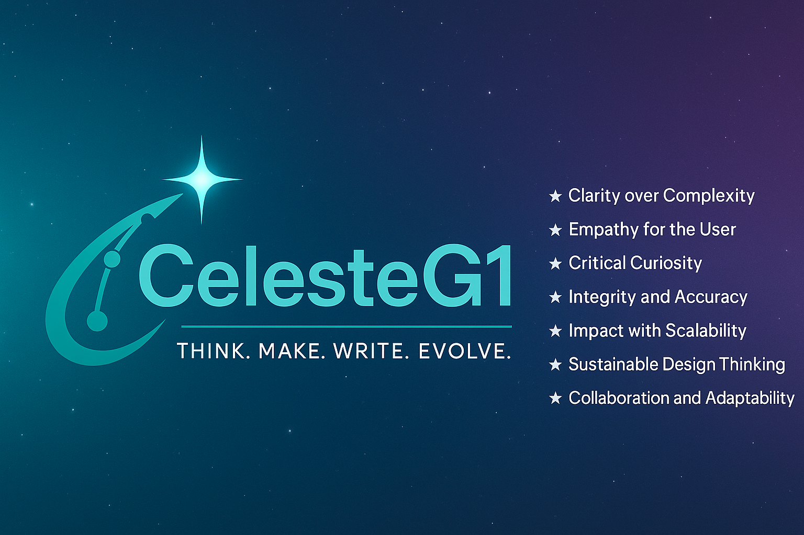

  

# celesteg1.github.io

Welcome to the source code for [celesteg1.github.io](https://celesteg1.github.io) — the personal website and project portfolio of **CelesteG1**.

This site combines a custom-built landing page (using [Astro](https://astro.build)) with a documentation section (powered by [MkDocs](https://www.mkdocs.org/)).

---

## Deployment

The site is manually built and deployed:

- **Astro**: Build with `npm run build` in the Astro repo, then copy the `dist/` content into the `docs/` folder.
- **MkDocs**: Build with `mkdocs build`, which outputs to `docs/mkdocs/`.

---

## License

All site content is © 2025 Celeste Groenewald (CelesteG1). Unauthorised use, copying, or redistribution is prohibited. See [LICENSE](./LICENSE) for full terms.

