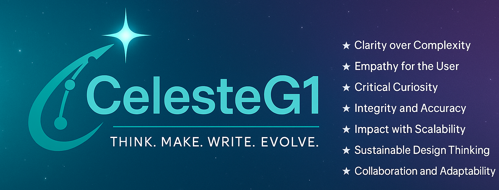

 

# Documentation Portfolio

Welcome! Explore the sections below to discover how I apply audience-focused documentation practices across real and fictional projects.

  <!-- Card 1: Fictional Examples -->
  

    <h3>📘 Fictional Examples</h3>
    

      Documentation created for interviews and conceptual projects.  
      These examples apply the Diátaxis framework to complex topics such as post-trade automation with tokenisation.
    

    <a href="examples/overview/" style="text-decoration: none; color: #0066cc; font-weight: bold;">Explore Fictional Examples →</a>
  

  <!-- Card 2: Official Docs -->
  

    <h3>📁 Official Docs</h3>
    

      Official documentation for my personal projects and repositories, showcasing practical, maintained, and user-friendly docs. And yes, Diátaxis framework applied!
    

    <a href="official-docs/overview" style="text-decoration: none; color: #0066cc; font-weight: bold;">Browse Real Docs →</a>
  

  <!-- Card 3: Blog -->
  

    <h3>📰 Blog</h3>
    

      Visit my blog for insights, reflections, and tips on technical writing, documentation best practices and other interesting topics.
    

     
    <a href="/blog" style="text-decoration: none; color: #0066cc; font-weight: bold;">Go to Blog →</a>
  

  <!-- Card 4: Research -->
  

    <h3>🎓 Research and Development (R&D) 🧪</h3>
    

      Summary of my PhD research and published papers, with plans to add prototype documentation and supporting videos.
    

    <a href="research/overview/" style="text-decoration: none; color: #0066cc; font-weight: bold;">Learn More About My Research →</a>
  

